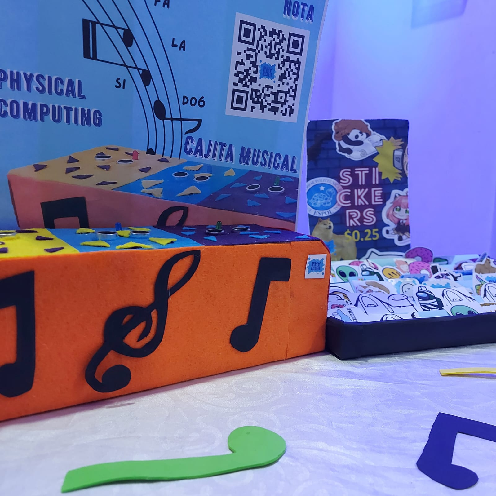
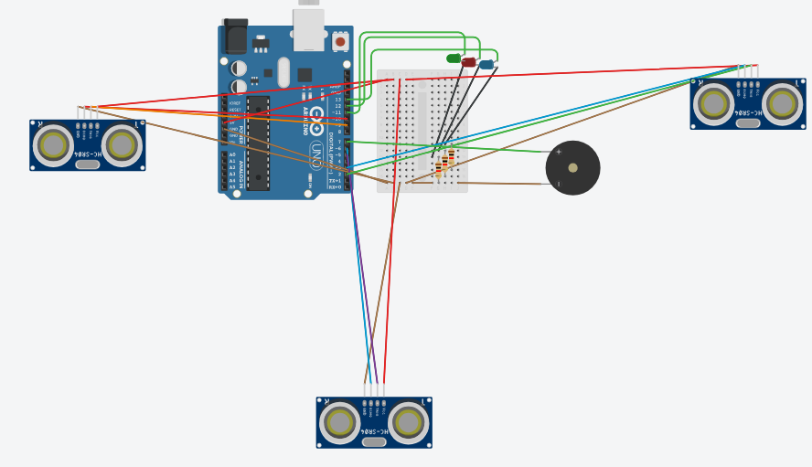
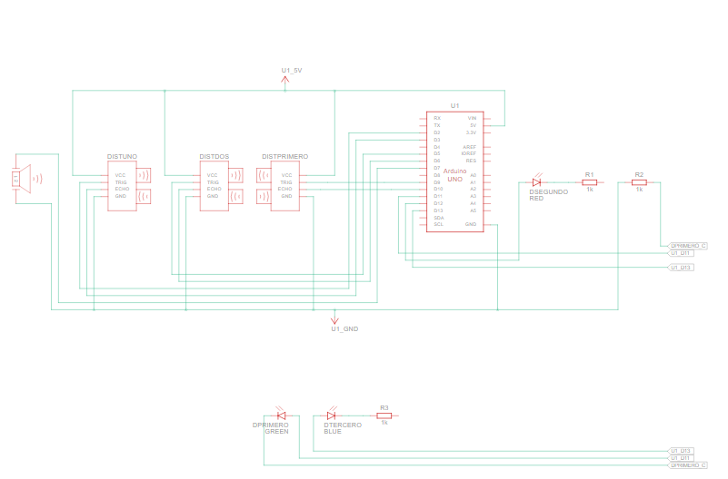

<h1 align="center"> Cajita Musical </h1>

 

## Descripcion  📋
---
Juego que simula un piano mediante el uso de sensores ultrasónicos, los cuales emiten una melodía a cierta distancia. 🧩👋

## Pre-requisitos  📋

Arduino IDE y conocmientos en C++

## Materiales  📦

A continuación se muestra una lista de los materiales requeridos, junto con la cantidad y el precio de cada uno:

  Nombre del Material  | Cantidad  |  
|----------------------|-----------|
| Sensor Ultrasónico   | 3         | 
| LEDS                 | 3         | 
| Buzzer               | 1         | 
| Cableado             | 10 metros | 

## Esquemas 📊

## Autores ✒️

* **Darinka Townsend** - [darinka Townsend](https://github.com/DarinkaTownsend)
* **Tyrone Rodriguez** 

## Video-demostrativo 🎥

https://github.com/PhycomEspol/Cajita-Musical/blob/main/video2.mp4

## Imagenes 📊

A continuación, se muestran algunas imágenes del proyecto:

